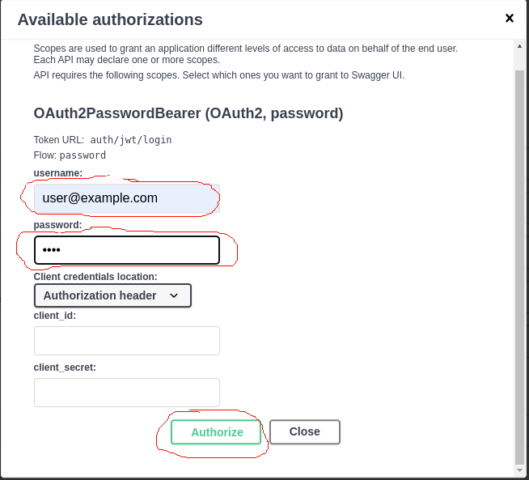

# Сервис по размещению объявлений.

### Использованы:
- Python
- FastAPI
- FastAPI-Users
- ORMAR
- docker-compose
- PostgreSQL.
***
##  Запуск
### команда на линукс:
    sudo docker compose up 
### команда на windows:
    docker-compose up

(!!!! перед запуском на windows необходимо в папке docker у файлов entrypoint.sh поменять кодировки окончания строк с CRLF на LF)

### Cтраница документации:
[http://0.0.0.0:8000/docs](http://0.0.0.0:8000/docs)

Эндпоинт для регистрации по пути: http://0.0.0.0:8000/auth/register

Дефолтный суперпользователь с правами администратора: 
email: default@example.com 
password:1234  
(нужен для назначения хотя бы отного администратора т.к. пользователи по умолчанию создаются без прав суперпользователя, а назначать пользователя администратором могут только администраторы)

Затем необходимо ввести те же данные для авторизации как на скриншоте

  

#### Объявления могут быть разных видов:
- продажа
- покупка
- оказание услуг
***
#### Основные роли системы: пользователь, администратор.

Возможности пользователя:
- Регистрация (http://0.0.0.0:8000/auth/register)
- Вход в систему (http://0.0.0.0:8000/auth/jwt/login)
- Размещение объявления
- Просмотр списка объявлений
- Детальный просмотр одного объявления
- Удаление своего объявления

Возможности администратора:
- Все выше перечисленное
- Удаление комментариев в любой группе объявлений
- Назначение пользователя администратором

***
Дополнительное описание:
- Авторизация с помощью JWT-токена
- Отзыв на размещенное объявление
- Бан/разбан пользователя администратором
- Сборка проекта в докер-образ
